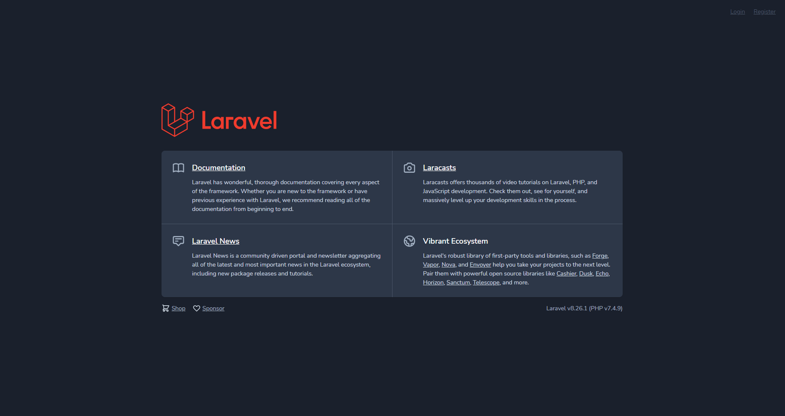
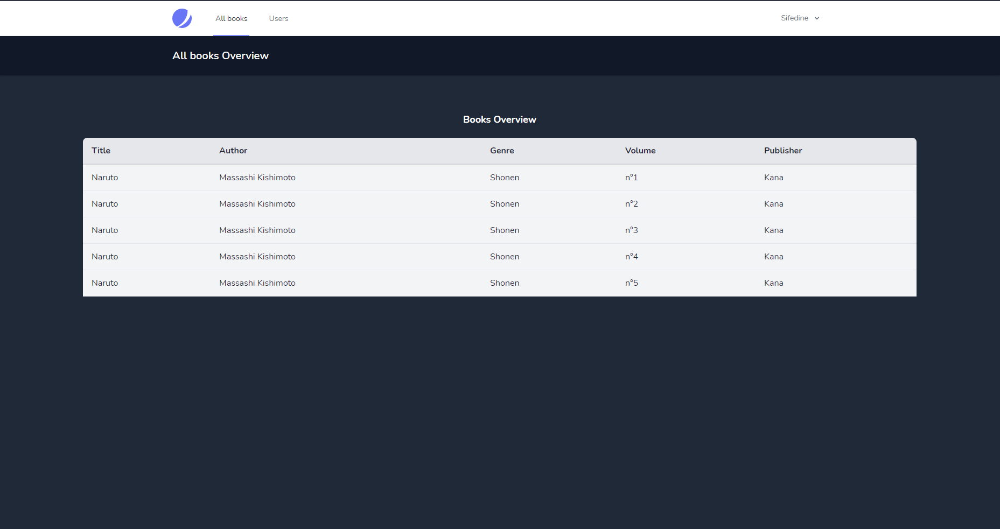
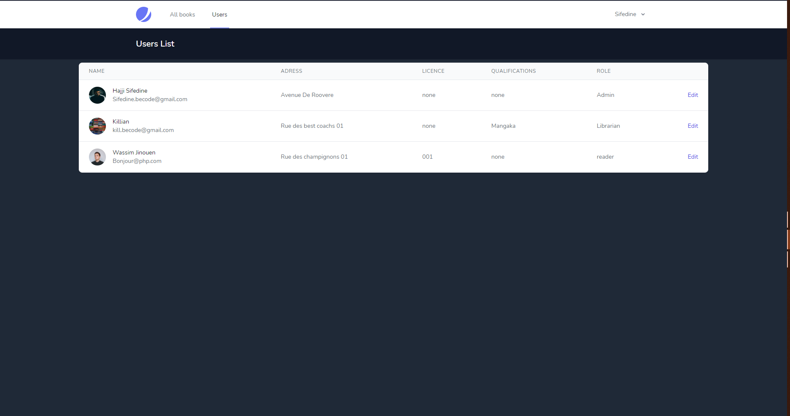
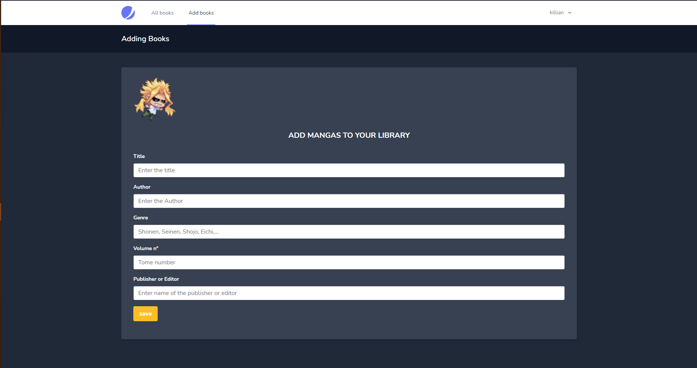
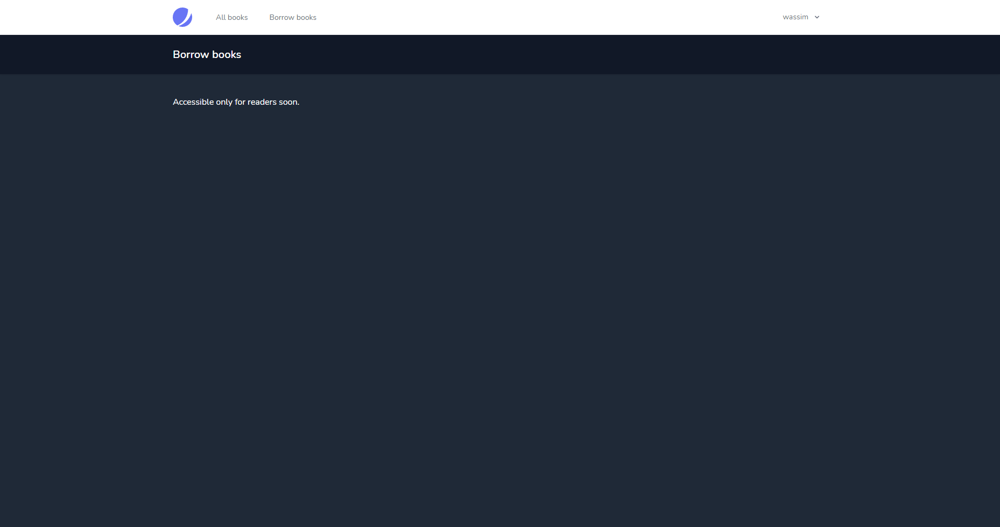

# Mangas-Library-Project

a Library project made with Laravel, Jetstream and TailwindCSS.

Let's imagine a strange virus hits the planet Earth : shopkeepers and restaurants are forced to find solutions in order to continue serving the public. Your mission, if you accept it, is to digitize the processes of the different companies affected by this terrible pandemic...

## Project infos

- **Type of challenge**: Laravel Exercice
- **Duration**: 3 days
- **Type challenge**: solo
- **Deadline**: 11-02-2021 17:00

## What is this project about :grey_question:

This is a web development exercise carried out with the BECODE training to learn various aspects and coding techniques. It consists of creating a library using Laravel 'PHP' framework.

## Objectif

- create a multi authentification system using in these case jetstream.
- the librarian can access to all books and add books.
- the readers can access to all the books available and **OPTIONAL**'borrow them'.

### Pre-requisite :bowtie:

What you need to get started ...

- basics in **PHP**
- basics in **Laravel**
- basics in **mvc architecture**

## What did I used ?

- Laravel framework/Jetstream
- TailwindCSS

## Strength

- Multi authentification system on point.
- Adding books to the Database works perfectly.

## Weaknesse

- I kept the random Laravel/jetstream visual for the welcome page but modified it a little bit because of time.
- I wasn't able to fetch data with laravel Routes system.
- styling with TailwindCSS above the basic jetstream style is difficult.
- I didn't have time to add the 'borrow book' system.

## Advice

- (Here you can write advices and comments about the project).

## Visual

## Authors

- **Sifedine** _alias_ [@Sifedine-Hajji](https://github.com/Sifedine-Hajji?tab=repositories)

With the help of classmates :gift_heart:
Thanks again to them!
